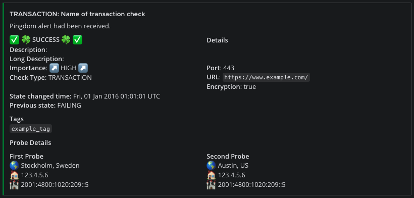
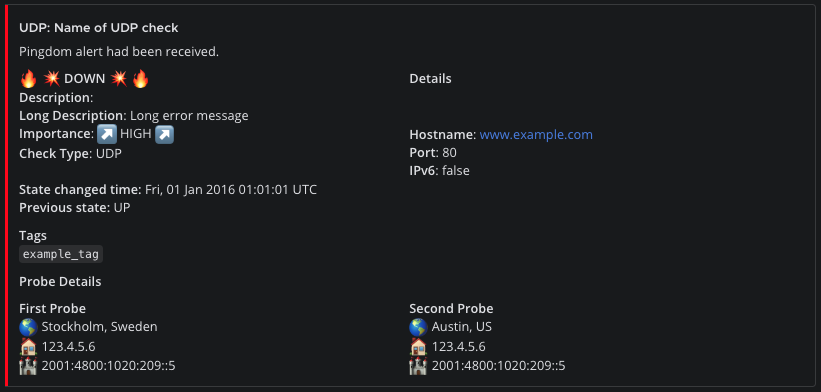
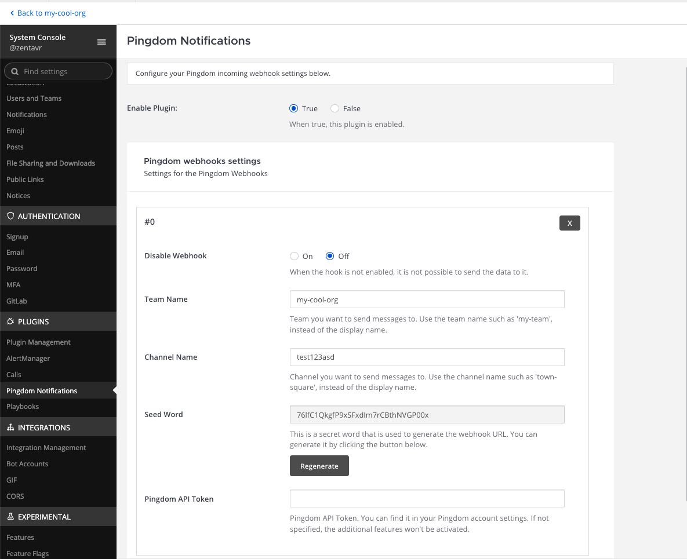
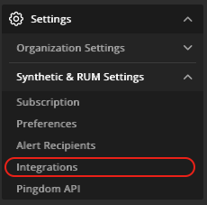

# Pingdom Alerting Integration with Mattermost

The plugin adds the integration of Pingdom Alerts with [Mattermost](https://mattermost.com/). The notifications are 
being published into the certain channels which you define in the webhook configuration.

The example of the good alert:

 

The example of the problem alert:

 

## Plugin Installation
There would be pre-compiled binaries later. For now you can clone the repo and compile yourself.
For the compilation you would need Linux/MacOS (FreeBSD/Windows WSL should work as well), GNU Make, tar, go 1.23, node v22.12.0+.
Then `make dist` and take the `tar.gz` from the `dist` folder of your repo.

1. Upload this file in the Mattermost **System Console > Plugins > Management** page to install the plugin, and enable 
   it. To learn more about how to upload a plugin, [see the documentation](https://docs.mattermost.com/administration/plugins.html#plugin-uploads).

If your server requires the plugins to be signed, kindly read 
[an official document](https://developers.mattermost.com/integrate/plugins/using-and-managing-plugins/#plugin-signing)
how you can create your own signing key and import that into the Mattermost installation.
Author's key ID is `3AF2387D` and the key is located at [GPG_SIGNING_3AF2387D.key](GPG_SIGNING_3AF2387D.key) of this repo.
To sign with your key, do (after you have the dist):

```shell
GPG_SIGNATURE_KEY_ID=YOUR_ID make sign
```

## Adding Webhook Configuration in Mattermost via plugin
Go to **System Console** as administrator, check **Plugins** - **Pingdom Notifications** and add the webhook like on 
the picture below.

 

You can add as many hooks as needed (for different Teams, Channels and Pingdom Accounts).

Pingdom API Token is not used right now. There are plans to be able to communicate to Pingdom using API and the bot 
in the future.

1. Copy the *Seed** above the **Save** button, which is used to configure the plugin for your Pingdom account.
2. Go to your Pingdom configuration, paste the following webhook URL and specify the name of the service and the 
   token you copied in the previous step.
3. Invite the `@pingdombot` user to your target team and channel.

The full URL looks like this (see below):
- `https://chat.example.com/plugins/com.zentavr.pingdom/api/webhook?seed=seed-phrase-here`

## Adding Webhook Configuration in Pingdom

1. Choose **Settings** and under **Synthetic & RUM Settings** pick up **Integrations**.
 
   
 
2. Press **Add Integration** button.
3. Choose type of **Webhook**
4. Put the **Name** (Anything human-readable)
5. Put the **URL**. The format is:
   - `https://chat.example.com/plugins/com.zentavr.pingdom/api/webhook?seed=seed-phrase-here`
   Where:
   - `https://chat.example.com` is the FQDN of your Mattermost server endpoint.
   - `seed-phrase-here` is the seed phrase which you had generated in the admin panel.
6. Pick up **Active** Checkbox
7. Press **Save Configuration** field

Supported checks:
1. `DNS` - DNS check
2. `HTTP` - HTTP check
3. `HTTP_CUSTOM` - HTTP Custom check
4. `IMAP` - IMAP check
5. `PING` - Ping check
6. `POP3` - POP3 check
7. `SMTP` - SMTP check
8. `PORT_TCP` - TCP check
9. `TRANSACTION` - Transaction check
10. `UDP` - UDP check

You can read about Pingdom Webhooks [here](https://www.pingdom.com/resources/webhooks/).

## For hackers, developers and contributors
Check [this document](HACKING.md) which, probably, tells you how the things organized. Also, kindly check poor official
documentation here:
- https://developers.mattermost.com/integrate/plugins/developer-setup/
- https://developers.mattermost.com/contribute/developer-setup/
